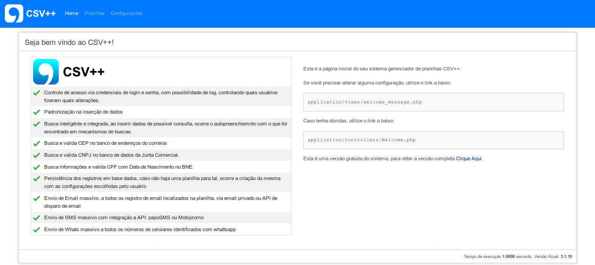
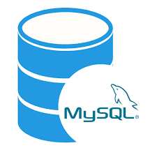

 

 

# gerenciador-de-planilha
Sistema para gerenciamento de planilhas, com possibilidade de múltiplos acessos por vários usuários em uma rede (intranet), com geração de gráficos e estatísticas

 
<table border="1">
	<tr>
		<td colspan="3">
			<b>Tecnologias Utilizadas</b>
		</td>
	</tr>
	<tr>
		<td>
			
		</td>
		<td>PHP 7.2</td>
		<td></td>
	</tr>
	<tr>
		<td>
			
		</td>
		<td>Code Igniter 3.2</td>
		<td></td>
	</tr>
	<tr>
		<td>
			
		</td>
		<td>MySQL</td>
		<td></td>
	</tr>
	<tr>
		<td>
			
		</td>
		<td>FireBase</td>
		<td></td>
	</tr>
	<tr>
		<td>
			
		</td>
		<td>DataTables</td>
		<td></td>
	</tr>
	<tr>
		<td>
			
		</td>
		<td>Angular 1.7.9</td>
		<td></td>
	</tr>
	<tr>
		<td>
			
		</td>
		<td>Bootstrap v4</td>
		<td></td>
	</tr>
</table>

<table border="0">
	<tr>
		<td colspan="2">
			<b>Participação</b>
		</td>
	</tr>
	<tr>
		<td>
			Ed Cruz 
			ed.cruz@tecnodatacfc.com.br
		</td>
		<td>
			Desenvolvimento do logo e identidade visual
		</td>
	</tr>
	<tr>
		<td>
			Victor Luis dos Santos 
			victorluissantos@live.com
		</td>
		<td>
			Análise e Desenvolvimento, programação: front e back
		</td>
	</tr>
</table>